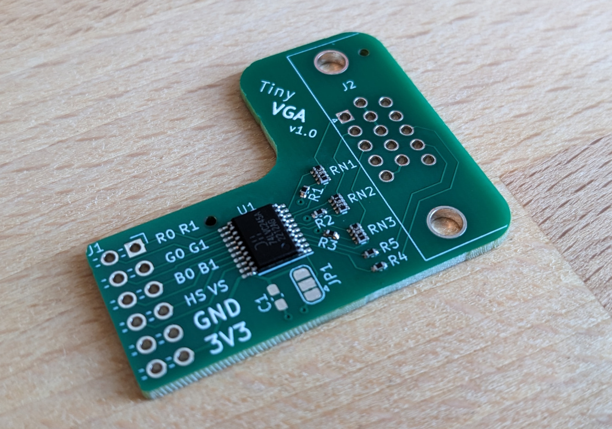
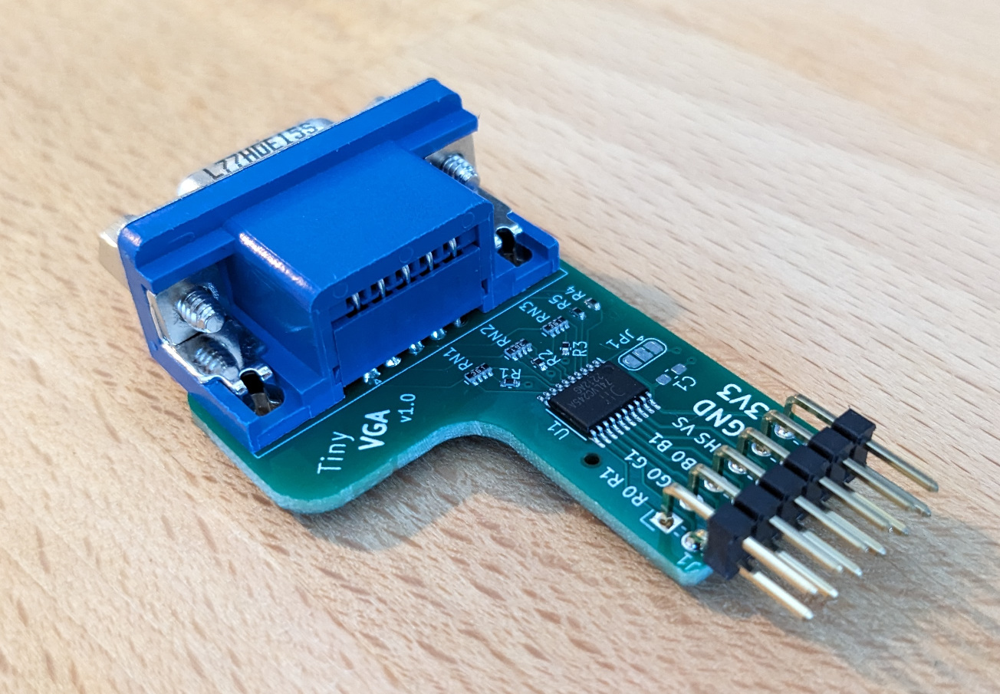
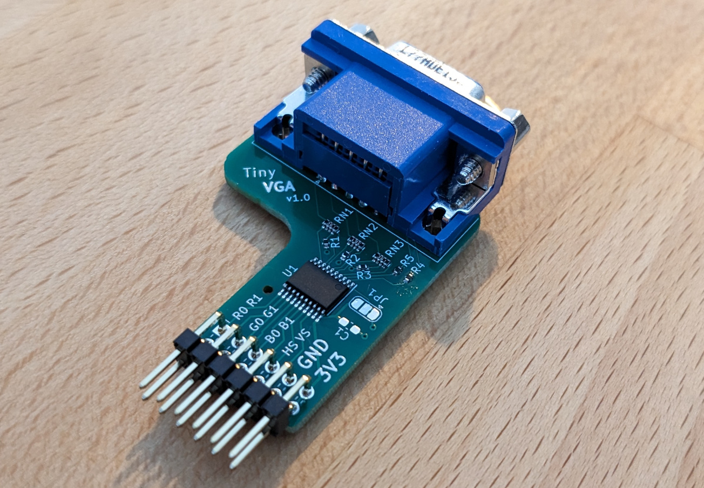
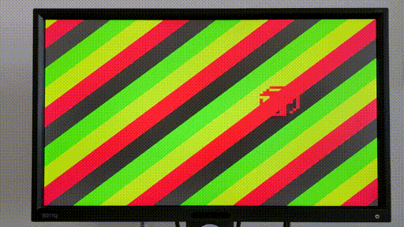

# Tiny VGA

Tiny VGA provides VGA output for up to two bits per color with just one Pmod. The board is designed in KiCad and uses two layers to be easily manufacturable.

JLCPCB was used to manufacture the board and place the SMD components. [KiCAD JLCPCB tools](https://github.com/Bouni/kicad-jlcpcb-tools) needs to be installed to create the production files found under `pcb/jlcpcb/production_files`.

For the VGA connector [this one](https://eu.mouser.com/ProductDetail/Amphenol-Commercial-Products/L77HDE15SD1CH4FVGA?qs=ToP8pWlZ0bNtQSp9f8k5Rw%3D%3D) was used.

# Pinout

Pin numbering according to Pmod specification.

| Pin | Signal |
|-----|--------|
| 1   | R1     |
| 2   | G1     |
| 3   | B1     |
| 4   | VS     |
| 5   | GND    |
| 6   | VCC    |
| 7   | R0     |
| 8   | G0     |
| 9   | B0     |
| 10  | HS     |
| 11  | GND    |
| 12  | VCC    |

R0, G0, B0 are the least significant bit
R1, G1, B1 are the most significant bit
VS ... vertical sync
HS ... horizontal sync
VCC must be 3V3

# Board Images

The board as it arrived from JLCPCB.

|          |      |
|--------------|-----------|
|  |       |

After soldering the Pmod and the VGA connector.

# Demo

# License

This work is licensed under a
[Creative Commons Attribution-ShareAlike 4.0 International License][cc-by-sa].

[cc-by-sa]: http://creativecommons.org/licenses/by-sa/4.0/

Copyright (c) Leo Moser